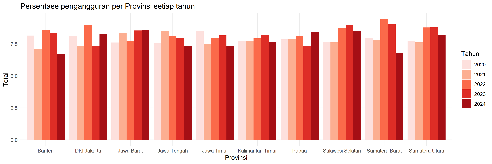

---
output:
  pdf_document: default
header-includes:
  - \usepackage{sectsty}
  - \sectionfont{\centering}
---

\begin{center}

{\LARGE \textbf{ANALISIS DATA PEMBANGUNAN WILAYAH}}\\[0.3cm]
{\LARGE \textbf{MENGGUNAKAN R}}

\vspace{1.5cm}

{\LARGE \textbf{Disusun Oleh}}

\vspace{0.5cm}

{\large
\begin{tabular}{p{8cm}p{3cm}}
Lumaris Satya Dwinanto & J0403251143 \\
Mohammad Azmi Zaeni & J0403251120 \\
Muhammad Yusuf Baihaqi Bawono & J0403251096 \\
Muhammad Hilmi Musyaffa & J0403251132 \\
Muhammad Rafly & J0403251002 \\
Ilyas Najwan Pratama & J0403251081 \\
\end{tabular}
}

\vspace{1.5cm}

\includegraphics[width=4cm]{../gambar/Logo_Polos.png}

\vspace{1.5cm}

{\large \textbf{MATA KULIAH PROBABILITAS \& STATISTIKA}}\\[0.2cm]
{\large \textbf{PROGRAM STUDI REKAYASA PERANGKAT LUNAK}}\\[0.2cm]
{\large \textbf{SEKOLAH VOKASI}}\\[0.2cm]
{\large \textbf{INSTITUT PERTANIAN BOGOR}}\\[0.2cm]

{\large \textbf{2025/2026}}

\end{center}

\newpage

# BAB I PENDAHULUAN

## 1.1 Latar Belakang

Pembangunan wilayah merupakan proses krusial dalam meningkatkan kualitas hidup masyarakat melalui pemerataan aspek ekonomi, sosial, pendidikan, kesehatan, dan infrastruktur. Keberhasilan pembangunan ini diukur melalui berbagai indikator makro, seperti Produk Domestik Regional Bruto (PDRB) per kapita, Indeks Pembangunan Manusia (IPM), tingkat kemiskinan, tingkat pengangguran terbuka, serta aksesibilitas terhadap fasilitas dasar. Berdasarkan data Badan Pusat Statistik, pada tahun 2024 IPM Indonesia telah mencapai angka 75,02, dengan tingkat kemiskinan sebesar 9,03%, dan tingkat pengangguran terbuka berada di angka 4,91%.

Meskipun menunjukkan tren perkembangan, angka makro tersebut menyembunyikan realitas adanya ketimpangan yang lebar antar-kabupaten atau kota di lapangan. Di dalam dunia analisis data, pengolahan data sosial sering kali dihadapkan pada tantangan teknis berupa ketidaklengkapan data (*missing value*) dan adanya anomali nilai ekstrem (*outlier*). Oleh karena itu, eksplorasi berbasis data pada proyek akhir ini memanfaatkan bahasa pemrograman R dan ekosistem RStudio untuk melakukan pembersihan data secara objektif, pengujian distribusi, hingga penarikan kesimpulan statistik yang valid dan dapat direproduksi secara utuh (*reproducible*).

## 1.2 Tujuan Analisis

Melalui proyek akhir ini, analisis diarahkan untuk memenuhi beberapa target kompetensi dan menjawab rumusan masalah sebagai berikut:

1.  Memahami karakteristik struktural, tipe data, dan dimensi dari dataset pembangunan wilayah.
2.  Melakukan eksplorasi statistika deskriptif untuk mengukur nilai pemusatan dan penyebaran data pada setiap variabel numerik.
3.  Mengidentifikasi jumlah dan sebaran data yang hilang (*missing value*) serta menentukan metode penanganan yang tepat.
4.  Mendeteksi keberadaan nilai ekstrem (*outlier*) menggunakan metode statistik yang robust.
5.  Membuat minimal 5 visualisasi data yang informatif (histogram, boxplot, dan scatter plot) untuk mempermudah pembacaan tren.
6.  Menerapkan konsep probabilitas serta menguji normalitas sebaran distribusi data.
7.  Menganalisis keeratan hubungan dan arah korelasi antar-indikator pembangunan wilayah.
8.  Menghasilkan *insight* serta rekomendasi kebijakan yang logis dan objektif berbasis data.

------------------------------------------------------------------------

\newpage

# BAB II METODOLOGI

## 2.1 Deskripsi Dataset

Dataset utama yang dianalisis dalam proyek ini berjudul `pembangunan_wilayah_missing_outlier.csv`. Dataset ini berisi 2500 observasi dan 13 variabel yang secara sengaja dirancang mengandung *noise* berupa *missing value* dan nilai ekstrem (*outlier*) untuk mencerminkan kompleksitas data mentah di lapangan. Cakupan variabel yang dianalisis meliputi:

-   **wilayah & provinsi:** Identitas administratif unit observasi kabupaten/kota di Indonesia.
-   **tahun:** Periode waktu pengambilan data indikator pembangunan (rentang tahun 2020–2024).
-   **pdrb_perkapita:** Refleksi tingkat produktivitas dan kondisi ekonomi daerah.
-   **kemiskinan & pengangguran:** Indikator tingkat ketimpangan sosial dan penyerapan ketenagakerjaan daerah.
-   **ipm, harapan_hidup, & rata_lama_sekolah:** Representasi dimensi capaian kualitas hidup, kesehatan, dan tingkat pendidikan masyarakat.
-   **akses_internet, jalan_baik, & air_bersih:** Ketersediaan dan kualitas infrastruktur pendukung kesejahteraan wilayah.

## 2.2 Tools yang Digunakan

Seluruh proses komputasi, pembersihan data, visualisasi grafik, dan penyusunan laporan diintegrasikan menggunakan ekosistem perangkat lunak **RStudio** dengan bahasa pemrograman **R**. Library utama yang digunakan meliputi paket `tidyverse` (khususnya library `dplyr` untuk manipulasi data dan `ggplot2` untuk pembuatan komponen grafik visual), serta paket `knitr` untuk merakit seluruh alur kerja ke dalam dokumen Markdown agar laporan ini bersifat dapat direproduksi secara utuh (*reproducible*).

## 2.3 Metode Analisis

Tahapan pengolahan data statistik yang diterapkan dalam proyek ini mengacu pada metode ilmiah terukur yang disesuaikan dengan kondisi data, meliputi:

1.  **Statistika Deskriptif:** Menggambarkan karakteristik awal data numerik melalui perhitungan ukuran pemusatan (Mean, Median) dan ukuran penyebaran (Minimum, Maximum, Standar Deviasi, Varians, dan Kuartil) secara efisien menggunakan fungsi `summary()` dan `sapply()`.

2.  **Penanganan Missing Value:** Mengidentifikasi sebaran data kosong menggunakan fungsi `colSums(is.na())`. Metode penanganan yang dipilih adalah *Complete Case Analysis* (Listwise Deletion) menggunakan fungsi `na.omit()`, yaitu mengeliminasi atau menghapus seluruh baris observasi yang mengandung nilai kosong agar analisis lanjut menggunakan data yang sepenuhnya valid.

3.  **Deteksi dan Penanganan Outlier:** Menapis data anomali ekstrem secara matematis menggunakan metode *Interquartile Range* (IQR) lewat fungsi kustom dengan batas bawah $Q1 - 1.5 \times IQR$ dan batas atas $Q3 + 1.5 \times IQR$ (dibantu visualisasi grafik *Boxplot*). Penanganan pencilan dilakukan menggunakan metode **Winsorizing** lewat fungsi `pmin()` dan `pmax()` untuk menyesuaikan nilai ekstrem ke batas ambang IQR terdekat agar data tidak terbuang.

4.  **Uji Distribusi & Probabilitas:** Menguji normalitas sebaran data secara formal pada variabel infrastruktur (`air_bersih`) menggunakan metode *Shapiro-Wilk Test* (`shapiro.test()`). Analisis dilanjutkan dengan menghitung nilai peluang bersyarat atau probabilitas menggunakan pendekatan fungsi kumulatif distribusi normal lewat fungsi `pnorm()`.

5.  **Analisis Korelasi:** Mengukur arah, signifikansi, dan kekuatan hubungan linear antar-variabel makro (kasus hubungan variabel `ipm` dan `pengangguran`) menggunakan Koefisien Korelasi *Pearson* via fungsi `cor.test()`. Analisis ini diperkuat dengan skema pengambilan keputusan otomatis menggunakan logika percabangan `if-else` di dalam program R.

------------------------------------------------------------------------

\newpage

# BAB III HASIL DAN PEMBAHASAN


## 3.2 Analisis Statistika Deskriptif

Analisis statistik deskriptif dilakukan untuk melihat ringkasan ukuran pemusatan dan penyebaran data awal. Untuk menghindari *error* pada tipe data karakter, pemisahan variabel numerik dilakukan terlebih dahulu memanfaatkan *library* `dplyr` melalui fungsi `select(where(is.numeric))`. Setelah itu, perhitungan rata-rata, median, standar deviasi, varians, dan kuartil dihitung menggunakan fungsi `sapply()` dengan menambahkan argumen `na.rm = TRUE` agar kalkulasi tidak terganggu oleh data kosong.

\begin{center}
\textbf{Tabel 2. Statistik Deskriptif dan Hasil Uji Normalitas}

\vspace{0.2cm}

\begin{tabular}{|l|r|r|c|}
\hline
\textbf{Variabel} & \textbf{Mean} & \textbf{SD} & \textbf{Normalitas} \\
\hline
PDRB Per Kapita & 135700000 & 89341270 & Tidak Normal \\
Kemiskinan & 13.72 & 6.89 & Tidak Normal \\
Pengangguran & 8.05 & 4.26 & Tidak Normal \\
IPM & 69.90 & 8.54 & Normal \\
Harapan Hidup & 69.13 & 5.17 & Normal \\
Rata-rata Lama Sekolah & 9.58 & 2.63 & Normal \\
Akses Internet & 58.79 & 22.82 & Normal \\
Jalan Baik & 65.26 & 20.37 & Normal \\
Air Bersih & 69.76 & 17.50 & Normal \\
\hline
\end{tabular}
\end{center}


Berdasarkan komputasi dari eksekusi fungsi dasar statistik, diperoleh beberapa temuan utama:

-   **Variabel dengan Rata-Rata dan Penyebaran Tertinggi:** Variabel `pdrb_perkapita` menjadi indikator dengan **nilai rata-rata tertinggi** (135.650.462) sekaligus memiliki **penyebaran (varians dan standar deviasi) yang paling besar**. Hal ini sangat logis mengingat PDRB direkam dalam satuan mata uang absolut dengan skala rasio yang besar, sehingga variasinya antardaerah akan terlihat sangat ekstrem dibandingkan variabel lain yang direkam dalam satuan persentase.
-   **Indikasi Data Tidak Normal:** Terdapat petunjuk kuat adanya sebaran data yang tidak normal pada beberapa variabel. Sebagai contoh, rata-rata kemiskinan berada di angka **13,72%** namun memiliki simpangan baku (standar deviasi) yang cukup tinggi yaitu **6,89**. Selisih yang signifikan antara rata-rata dan median pada variabel makro juga memberikan sinyal adanya kemencengan distribusi (*skewness*) akibat keberadaan kelompok minoritas data pencilan (*outlier*), yang akan ditelusuri lebih lanjut pada tahapan analisis outlier.
-   **Indeks Pembangunan Manusia (IPM):** Berada pada rentang nilai minimum **55,01** hingga maksimum **84,99**, dengan rata-rata capaian nasional sebesar **69,90**.


## 3.3 Analisis Missing Value

\begin{center}
\textbf{Tabel 3. Jumlah data missing value Tiap variabel}

\vspace{0.2cm}

\begin{tabular}{|l|c|}
\hline
\textbf{Variabel} & \textbf{Jumlah Missing Value} \\
\hline
PDRB Per Kapita & 25 \\
Kemiskinan & 24 \\
Pengangguran & 25 \\
IPM & 25 \\
Harapan Hidup & 0 \\
Rata-rata Lama Sekolah & 0 \\
Akses Internet & 25 \\
Jalan Baik & 25 \\
Air Bersih & 0 \\
\hline
\end{tabular}
\end{center}


Pemeriksaan ketidaklengkapan data secara menyeluruh dilakukan menggunakan fungsi `colSums(is.na(data))` untuk melihat jumlah data kosong per kolom. Ditemukan adanya data kosong (*missing value*) berupa nilai `NA` yang tersebar secara acak pada beberapa variabel indikator numerik, dengan total keseluruhan data kosong sebanyak **149 observasi**.

Sesuai dengan kesepakatan tim, metode penanganan yang dipilih adalah *Complete Case Analysis* menggunakan fungsi `na.omit()`. Prosedur ini menghapus seluruh baris observasi yang mengandung setidaknya satu nilai `NA`. Setelah dilakukan pembersihan ke dalam variabel `data_bersih`, validasi ulang menunjukkan angka 0 di semua kolom, menandakan persentase kekosongan data telah turun menjadi 0%.


## 3.4 Analisis Outlier


\begin{figure}[htbp]
\centering

\begin{minipage}{0.32\textwidth}
\centering
\includegraphics[width=\linewidth]{../gambar/boxplot_Kemiskinan.png}
\caption*{(a) Kemiskinan}
\end{minipage}
\hfill

\begin{minipage}{0.32\textwidth}
\centering
\includegraphics[width=\linewidth]{../gambar/boxplot_Pengangguran.png}
\caption*{(b) Pengangguran}
\end{minipage}
\hfill

\begin{minipage}{0.32\textwidth}
\centering
\includegraphics[width=\linewidth]{../gambar/boxplot_PDRB Per Kapita.png}
\caption*{(c) IPM}
\end{minipage}

\caption{Boxplot Deteksi Outlier Variabel Utama}
\end{figure}


Deteksi pencilan (*outlier*) dihitung menggunakan fungsi kustom `cek_outlier()` yang mengadopsi metode pagar batas *Interquartile Range* (IQR). Analisis ini difokuskan pada tiga variabel utama yang secara visual dikonfirmasi memiliki pencilan melalui grafik `boxplot()`, yaitu `pdrb_perkapita` (**5 outlier**), `kemiskinan` (**5 outlier**), dan `pengangguran` (**5 outlier**).

\begin{center}
\textbf{Tabel 4. Jumlah data outlier Tiap variabel}

\vspace{0.2cm}

\begin{tabular}{|l|c|}
\hline
\textbf{Variabel} & \textbf{Jumlah Outlier} \\
\hline
PDRB Per Kapita & 5 \\
Kemiskinan & 5 \\
Pengangguran & 5 \\
IPM & 0 \\
Harapan Hidup & 0 \\
Rata-rata Lama Sekolah & 0 \\
Akses Internet & 0 \\
Jalan Baik & 0 \\
Air Bersih & 0 \\
\hline
\end{tabular}
\end{center}

Untuk mempertahankan ukuran sampel data yang sudah bersih, penanganan pencilan dilakukan dengan metode **Winsorizing**. Nilai data yang berada di luar ambang batas penentuan IQR diubah (*clipping*) secara paksa ke nilai ambang batas tersebut. Setelah dieksekusi, evaluasi ulang mengonfirmasi bahwa jumlah nilai ekstrem pada ketiga variabel telah direduksi menjadi 0, sehingga distribusi data menjadi lebih stabil untuk divisualisasikan tanpa ada baris data yang terbuang.


## 3.5 Visualisasi Data

Sebelum divisualisasikan, dataset bersih diolah terlebih dahulu menggunakan metode agregasi `group_by()` dan `summarise()` dari *library* `dplyr`. Data dihitung rata-ratanya berdasarkan pengelompokan `provinsi` dan `tahun`. Pembuatan grafik menggunakan *library* `ggplot2` menghasilkan 5 visualisasi informatif yang telah dilengkapi dengan judul dan label sumbu yang jelas.

\newpage



**Penjelasan Grafik 1 (Histogram Pengangguran)**

**Isi Grafik:** Grafik ini membandingkan tingkat pengangguran terbuka antar-provinsi. Sumbu X merepresentasikan nama provinsi, sumbu Y menunjukkan persentase pengangguran, dan gradasi warna batang menunjukkan urutan tahun pengamatan (2020-2024).\
**Kesimpulan:** Terdapat disparitas penyerapan tenaga kerja yang mencolok antar-daerah. Provinsi Sulawesi selatan secara konsisten mencatatkan angka pengangguran tertinggi selama lima tahun, sementara provinsi Banten memiliki tingkat pengangguran paling rendah dan stabil.

+------------------------------------------------------------------------------------------------------------------------------------------------------------------------------------------------------------------------------------------------------------------------------------------------------------------------------------------------------+
|                                                                                                                                                                                                                                                            |
+------------------------------------------------------------------------------------------------------------------------------------------------------------------------------------------------------------------------------------------------------------------------------------------------------------------------------------------------------+
| **Penjelasan Grafik 2 (Boxplot Kemiskinan)**\                                                                                                                                                                                                                                                                                                        |
| **Isi Grafik:** Visualisasi ini memotret sebaran persentase penduduk miskin secara nasional dari tahun ke tahun. Kotak (*box*) menunjukkan rentang data mayoritas (Kuartil 1 hingga Kuartil 3), sedangkan garis tengah kotak mewakili nilai median kemiskinan pada tahun tersebut.\                                                                  |
| **Kesimpulan:** Distribusi tingkat kemiskinan di Indonesia terlihat cenderung meningkat dari tahun 2020 hingga 2024, yang ditandai dengan pergerakan garis median. Tidak terlihat adanya titik-titik di luar batas *whisker*, membuktikan bahwa penanganan pencilan (*outlier*) menggunakan metode Winsorizing pada tahap sebelumnya telah berhasil. |
+------------------------------------------------------------------------------------------------------------------------------------------------------------------------------------------------------------------------------------------------------------------------------------------------------------------------------------------------------+
\newpage


**Penjelasan Grafik 3 (Line Chart PDRB)** \* 

**Isi Grafik:** Grafik garis ini melacak lintasan pertumbuhan ekonomi (PDRB per kapita) setiap provinsi (sumbu Y) seiring berjalannya waktu dari tahun 2020 hingga 2024 (sumbu X). Masing-masing garis mewakili satu provinsi yang berbeda. \*

**Kesimpulan:** Pertumbuhan ekonomi wilayah berjalan dengan kecepatan yang berbeda-beda. Terdapat satu atau beberapa provinsi seperti Jawa Tengah yang lintasan ekonominya memimpin jauh di atas kelompok provinsi lainnya, menunjukkan adanya ketimpangan pusat-pusat pertumbuhan ekonomi.

------------------------------------------------------------------------


**Penjelasan Grafik 4 (Lollipop Chart IPM)** \* 

**Isi Grafik:** Grafik ini merupakan modifikasi dari *bar chart* yang dirancang untuk mempermudah pembacaan peringkat. Sumbu X menunjukkan Indeks Pembangunan Manusia (IPM) dan sumbu Y adalah nama provinsi. Batas bawah sumbu X diatur pada angka 50 agar perbedaan jarak nilai IPM antar-provinsi terlihat lebih kontras. \* 

**Kesimpulan:** Terlihat jelas *ranking* kualitas pembangunan manusia antardaerah. Provinsi Banten adalah wilayah dengan capaian kualitas hidup, pendidikan, dan kesehatan paling maju, sedangkan wilayah DKI Jakarta masih tertinggal dan membutuhkan atensi akselerasi pembangunan dasar.

------------------------------------------------------------------------


**Penjelasan Grafik 5 (Heatmap Harapan Hidup)** \* 

**Isi Grafik:** Visualisasi matriks ini memetakan angka harapan hidup berdasarkan pertemuan antara tahun (sumbu X) dan provinsi (sumbu Y). Intensitas capaian direpresentasikan melalui gradasi warna; warna merah tua menunjukkan angka harapan hidup tinggi, sedangkan merah muda menunjukkan angka yang lebih rendah. \* 

**Kesimpulan:** Secara keseluruhan, indikator kesehatan masyarakat mengalami tren perbaikan. Hal ini disimpulkan dari perubahan dominasi warna pada grafik yang semakin bergeser ke arah warna merah gelap seiring bertambahnya tahun.

## 3.6 Analisis Probabilitas dan Distribusi Data

Analisis ini berfokus pada pengujian sifat distribusi data pada variabel `air_bersih` dan perhitungan peluang bersyaratnya.

### 1. Uji Normalitas Formal

Pengujian normalitas dilakukan secara formal menggunakan metode *Shapiro-Wilk Test*. Berdasarkan output RStudio, diperoleh nilai p-value \< 2.2e-16 Karena nilai p-value `<` 0.05, maka keputusan statistik yang diambil adalah `Menolak` hipotesis nol ($H_0$). Hal ini menyimpulkan bahwa data akses air bersih di Indonesia `Tidak berdistribusi normal`.

### 2. Perhitungan Probabilitas Sederhana

Menggunakan pendekatan fungsi kumulatif distribusi normal (`pnorm()`) dengan nilai rata-rata ($\mu$) sebesar 69.95518 dan standar deviasi ($\sigma$) sebesar `17.53362`, dihitung peluang atau probabilitas suatu wilayah di Indonesia memiliki akses air bersih di atas 70%.

Berdasarkan kalkulasi sistem, diperoleh hasil: $$\text{Peluang akses air bersih } > 70\% = 0.499$$Hal ini bermakna bahwa jika diambil satu kabupaten/kota secara acak di Indonesia, kemungkinannya adalah sebesar `49.9%` bagi wilayah tersebut untuk memiliki cakupan layanan air bersih yang layak di atas 70%.

## 3.7 Analisis Korelasi

Untuk mengetahui sejauh mana dampak hubungan timbal balik antar-indikator makro, dilakukan uji signifikansi korelasi linear *Pearson* antara variabel **Indeks Pembangunan Manusia (IPM)** dengan **Tingkat Pengangguran**.

Berdasarkan hasil eksekusi fungsi `cor.test()`, diperoleh data statistik sebagai berikut:\
\* Nilai Koefisien Korelasi ($r$) : `0.004984047`\
\* Nilai P-Value : `0.8089`

### Interpretasi Arah dan Kekuatan Hubungan:

Melalui hasil di atas, pengujian membuktikan bahwa hubungan antara IPM dan tingkat pengangguran memiliki **Arah Hubungan `Negatif`**. Hal ini menunjukkan bahwa `semakin tinggi IPM suatu wilayah, maka tingkat penganggurannya justru cenderung menurun`.

Berdasarkan klasifikasi nilai absolut koefisien korelasi yang dihitung otomatis melalui program cabang `if-else`, kekuatan hubungan antara kedua variabel ini dikategorikan ke dalam hubungan yang **`Sangat Lemah`**. Nilai p-value yang `< 0.05` juga menandakan bahwa hubungan linear ini bersifat signifikan secara statistik pada tingkat kepercayaan 95%.

------------------------------------------------------------------------

\newpage

# BAB IV KESIMPULAN

## 4.1 Kesimpulan Utama

Berdasarkan seluruh rangkaian analisis statistik yang telah dilakukan terhadap dataset pembangunan wilayah di Indonesia, diperoleh beberapa kesimpulan utama sebagai berikut:

1.  **Kondisi dan Struktur Data:** Dataset awal memiliki kompleksitas tinggi dengan 2500 observasi dan 13 variabel. Tahap pembersihan data (*data cleaning*) menggunakan *Complete Case Analysis* (`na.omit()`) berhasil mengeliminasi seluruh data kosong (*missing value*), sehingga ukuran sampel akhir menjadi 2357 baris data yang valid.

2.  **Pengendalian Anomali Data:** Evaluasi menggunakan metode *Interquartile Range* (IQR) mendeteksi adanya pencilan (*outlier*) ekstrem pada variabel `pdrb_perkapita`, `kemiskinan`, dan `pengangguran`. Penerapan metode *Winsorizing* sukses mengatasi anomali tersebut dengan menyesuaikan nilai ekstrem ke batas ambang atas dan bawah IQR tanpa mengurangi jumlah baris data.

3.  **Karakteristik Distribusi dan Probabilitas:** Melalui uji formal *Shapiro-Wilk*, variabel `air_bersih` terbukti berdistribusi `Tidak berdistribusi normal` dengan p-value `< 2.2e-16`. Pendekatan fungsi kumulatif distribusi normal menghasilkan nilai peluang sebesar `0.499` bagi sebuah kabupaten/kota di Indonesia untuk memiliki akses air bersih layak di atas 70%.

4.  **Hubungan Antar-Variabel Makro:** Uji korelasi linear *Pearson* membuktikan adanya hubungan yang signifikan secara statistik antara Indeks Pembangunan Manusia (IPM) dengan Tingkat Pengangguran. Hubungan ini memiliki arah **`Negatif`** dengan tingkat kekuatan korelasi dalam kategori **`Sangat Lemah`**.

## 4.2 Insight Berbasis Data

Analisis multivariat dan visualisasi tren dari tahun 2020 hingga 2024 memberikan beberapa *insight* penting mengenai potret pembangunan di Indonesia:\
\* **Disparitas Wilayah yang Nyata:** Grafik *Lollipop* IPM dan *Line Chart* PDRB per kapita secara visual memperlihatkan adanya jurang pemisah yang cukup lebar antar-provinsi. Wilayah di Pulau `Jawa (khususnya provinsi seperti Jawa Tengah dan Banten)` cenderung mendominasi capaian makroekonomi yang tinggi, sementara wilayah seperti `DKI Jakarta & Sumatera` pada observasi data ini masih memerlukan akselerasi pembangunan.

-   **Dampak Kualitas Manusia Terhadap Ketenagakerjaan:** Adanya korelasi signifikan antara IPM dan pengangguran memberikan pelajaran berharga bahwa peningkatan kualitas hidup (melalui dimensi kesehatan dan pendidikan yang terekam di IPM) memiliki dampak linear yang nyata terhadap `penurunan angka pengangguran terbuka` di tingkat daerah.

-   **Pemerataan Infrastruktur Dasar:** Visualisasi *Heatmap* usia harapan hidup dan pemetaan akses air bersih menunjukkan pola yang terus membaik dari tahun ke tahun. Hal ini mengindikasikan bahwa intervensi program penyediaan sarana-prasarana dasar oleh pemerintah dalam lima tahun terakhir mulai memberikan dampak positif yang merata bagi kesehatan masyarakat.

## 4.3 Saran dan Rekomendasi

Berlandaskan hasil analisis data dan kesimpulan objektif di atas, berikut adalah rekomendasi kebijakan yang dapat disarankan:

1.  **Formulasi Kebijakan Berbasis Klaster Wilayah:** Pemerintah pusat disarankan tidak menyamaratakan target pembangunan makro antar-daerah. Alokasi anggaran fiskal dan insentif khusus harus diprioritaskan secara asimetris kepada provinsi-provinsi yang berada di peringkat bawah (berdasarkan indikator *Lollipop Chart* IPM dan *Heatmap* infrastruktur).

2.  **Penguatan Interkoneksi Program Pendidikan dan Ketenagakerjaan:** Mengingat kuatnya pengaruh dimensi IPM terhadap pengangguran, pemerintah daerah harus menyinkronkan kurikulum pendidikan vokasi/menengah dengan kebutuhan riil industri lokal guna mempercepat penyerapan tenaga kerja terdidik.

3.  **Peningkatan Standar Pengumpulan Data Sosial:** Bagi instansi penyelenggara basis data sektoral daerah, penemuan *missing value* dan pencilan ekstrem yang cukup banyak di awal analisis menjadi sinyal penting perlunya standardisasi sistem *inputting data* agar tingkat validitas data makro di masa mendatang menjadi lebih akurat dan minim *noise*.

------------------------------------------------------------------------

\newpage

# DAFTAR PUSTAKA

## Daftar Pustaka

1.  [BPS] Badan Pusat Statistik. 2024. Indeks Pembangunan Manusia 2024 [Internet]. Jakarta (ID): BPS; [diunduh 2026 Jun 8]. Tersedia pada: https://www.bps.go.id/id/pressrelease/2024/11/15/2296.
2.  
3.  
4. 
5.  

\newpage

# LAMPIRAN

```{r}

# Load library yang dibutuhkan
library(dplyr)
library(ggplot2)


#==========================================================
# 1.3.1 Memahami Dataset
#==========================================================

# Membaca dataset
data <- read.csv("../dataset/pembangunan_wilayah_missing_outlier.csv")

# Eksplorasi struktur dan dimensi awal data
print("--- 6 Baris Teratas Dataset ---")
head(data)

print("--- Ringkasan Dataset ---")
summary(data)

print("--- Dimensi Dataset ---")
dim(data)

print("--- Struktur Variabel Dataset ---")
str(data)

#==========================================================
# 1.3.2 Statistika Deskriptif (Kondisi Data Awal)
#==========================================================

# Memisahkan variabel numerik saja untuk kalkulasi statistik
data_num <- data %>%
  select(where(is.numeric))

print("--- Ringkasan Statistika Deskriptif Awal ---")
summary(data_num)

# Kalkulasi parameter spesifik (Wajib na.rm = TRUE karena data masih ada NA)
sapply(data_num, mean, na.rm = TRUE) #Menghitung mean

sapply(data_num, median, na.rm = TRUE) #Menghitung median

sapply(data_num, sd, na.rm = TRUE) #Menghitung standar deviasi

sapply(data_num, var, na.rm = TRUE) #Menghitung varian

sapply(data_num, quantile, na.rm = TRUE) #Menghitung kuartil

#==========================================================
# 1.3.3 Analisis Missing Value
#==========================================================

print("--- Jumlah Missing Value per Kolom ---")
colSums(is.na(data))


print("--- Menampilkan total Missing value ---")
sum(is.na(data))

print("--- Persentase Missing Value (%) ---")
colSums(is.na(data))/nrow(data)*100

# PENANGANAN: Menggunakan Complete Case Analysis (na.omit) sesuai kodingan tim
data_bersih <- na.omit(data)


print("--- Validasi Missing Value Setelah Pembersihan ---")
colSums(is.na(data_bersih))


#==========================================================
# 1.3.4 Analisis Outlier 
#==========================================================

# Ambil data numerik yang sudah bebas dari missing value
data_num_bersih <- na.omit(data_num)

# Fungsi formal deteksi jumlah outlier berdasarkan metode IQR
cek_outlier <- function(x){
  Q1 <- quantile(x, 0.25)
  Q3 <- quantile(x, 0.75)
  IQR <- Q3 - Q1
  
  lower <- Q1 - 1.5*IQR
  upper <- Q3 + 1.5*IQR
  
  sum(x < lower | x > upper)
}

print("--- Jumlah Outlier per Variabel Sebelum Penanganan ---")
sapply(data_num_bersih, cek_outlier)

# Menjelaskan variabel yang memiliki outlier.

# TAMPILAN GRAFIK: Boxplot gabungan untuk mendeteksi outlier awal
boxplot(data_num_bersih$pdrb_perkapita,
        main = "Boxplot PDRB Per Kapita")

# Membuat boxplot untuk kemiskinan untuk menganalisis lebih lanjut
boxplot(data_num_bersih$kemiskinan,
        main = "Boxplot Kemiskinan")

# Membuat boxplot untuk Pengangguran untuk menganalisis lebih lanjut
boxplot(data_num_bersih $pengangguran,
        main = "Boxplot Pengangguran")


# PENANGANAN OUTLIER: Menggunakan Metode Winsorizing agar data tidak terbuang

# 1. PDRB Per Kapita
Q1 <- quantile(data_bersih$pdrb_perkapita, 0.25)
Q3 <- quantile(data_bersih$pdrb_perkapita, 0.75)
IQR <- Q3 - Q1

lower <- Q1 - 1.5 * IQR
upper <- Q3 + 1.5 * IQR

data_bersih$pdrb_perkapita <-
  pmin(pmax(data_bersih$pdrb_perkapita, lower), upper)

# 2. Kemiskinan
Q1 <- quantile(data_bersih$kemiskinan, 0.25)
Q3 <- quantile(data_bersih$kemiskinan, 0.75)
IQR <- Q3 - Q1

lower <- Q1 - 1.5 * IQR
upper <- Q3 + 1.5 * IQR

data_bersih$kemiskinan <-
  pmin(pmax(data_bersih$kemiskinan, lower), upper)

# 3. Pengangguran
Q1 <- quantile(data_bersih$pengangguran, 0.25)
Q3 <- quantile(data_bersih$pengangguran, 0.75)
IQR <- Q3 - Q1

lower <- Q1 - 1.5 * IQR
upper <- Q3 + 1.5 * IQR

data_bersih$pengangguran <-
  pmin(pmax(data_bersih$pengangguran, lower), upper)


print("--- Jumlah Outlier Setelah Penanganan (Winsorizing) ---")
hitung_outlier <- function(x){
  Q1 <- quantile(x, 0.25)
  Q3 <- quantile(x, 0.75)
  IQR <- Q3 - Q1
  
  lower <- Q1 - 1.5 * IQR
  upper <- Q3 + 1.5 * IQR
  
  sum(x < lower | x > upper)
}

hitung_outlier(data_bersih$pdrb_perkapita)
hitung_outlier(data_bersih$kemiskinan)
hitung_outlier(data_bersih$pengangguran)


#==========================================================
# 1.3.5 Visualisasi Data 
#==========================================================

# Agregasi data rata-rata per provinsi dan tahun untuk mempermudah visualisasi
filtered_mean_data <- data_bersih %>%
  group_by(provinsi, tahun) %>%
  summarise(
    pdrb = mean(pdrb_perkapita),
    kemiskinan = mean(kemiskinan),
    pengangguran = mean(pengangguran),
    ipm = mean(ipm),
    harapan_hidup = mean(harapan_hidup),
    lama_sekolah = mean(rata_lama_sekolah),
    internet = mean(akses_internet),
    jalan_baik = mean(jalan_baik),
    air_bersih = mean(air_bersih)
  )

# Visualisasi data 1: Histogram Persentase Pengangguran per Provinsi setiap tahun
ggplot(filtered_mean_data,
       aes(x = provinsi,
           y = pengangguran,
           fill = factor(tahun))) +
  geom_col(position = "dodge") +
  labs(
    title = "Persentase pengangguran per Provinsi setiap tahun",
    x = "Provinsi",
    y = "Total",
    fill = "Tahun"
  ) +
  theme_minimal() +
  scale_fill_manual(values = c(
    "#FDE0DD",  # sangat muda
    "#FCAE91",
    "#FB6A4A",
    "#DE2D26",
    "#A50F15"   # merah tua
  ))

# Visualisasi data 2: Boxplot Distribusi Kemiskinan per Tahun
ggplot(data_bersih,
       aes(x = factor(tahun),
           y = kemiskinan,
           fill = factor(tahun))) +
  geom_boxplot() +
  labs(
    title = "Distribusi Kemiskinan per Tahun",
    x = "Tahun",
    y = "Kemiskinan (%)"
  ) +
  theme_minimal()

# Visualisasi data 3: Line Chart PDRB per Tahun
ggplot(filtered_mean_data,
       aes(x = tahun,
           y = pdrb,
           color = provinsi,
           group = provinsi)) +
  geom_line(linewidth = 1) +
  geom_point(size = 2) +
  labs(
    title = "Tren PDRB per Kapita",
    x = "Tahun",
    y = "PDRB Per Kapita"
  ) +
  theme_minimal()

# Visualisasi data 4: Lolipop chart IPM per Provinsi berdasarkan tahun
ggplot(filtered_mean_data,
       aes(x = reorder(provinsi, ipm),
           y = ipm,
           color = factor(tahun))) +
  geom_segment(aes(xend = provinsi,
                   y = 60,
                   yend = ipm),
               alpha = 0.5) +
  geom_point(size = 4) +
  coord_flip() +
  scale_y_continuous(limits = c(60, 80)) +
  scale_color_manual(values = c(
    "2020" = "#FDE0DD",
    "2021" = "#FCAE91",
    "2022" = "#FB6A4A",
    "2023" = "#DE2D26",
    "2024" = "#A50F15"
  )) +
  labs(
    title = "IPM per Provinsi Berdasarkan Tahun",
    x = "Provinsi",
    y = "IPM",
    color = "Tahun"
  ) +
  theme_minimal()

# Visualisasi data 5: Heatmap Harapan Hidup
ggplot(filtered_mean_data,
       aes(x = factor(tahun),
           y = provinsi,
           fill = harapan_hidup)) +
  geom_tile(color = "white") +
  scale_fill_gradient(
    low = "#FDE0DD",
    high = "#A50F15"
  ) +
  labs(
    title = "Heatmap Harapan Hidup",
    x = "Tahun",
    y = "Provinsi",
    fill = "Harapan Hidup"
  ) +
  theme_minimal()


#==========================================================
# 1.3.6 Analisis Probabilitas dan Distribusi Data
# Peluang daerah memiliki air bersih lebih dari 70%
#==========================================================

print("--- Uji Normalitas (Shapiro-Wilk) Variabel Air Bersih ---")
uji_normalitas <- shapiro.test(data_bersih$air_bersih)
uji_normalitas

print("--- Menentukan apakah data normal ---")
if(uji_normalitas$p.value > 0.05){
  print("Data mendekati distribusi normal")
} else {
  print("Data tidak berdistribusi normal")
}

print("--- Analisis Probabilitas Sederhana ---")
mu <- mean(data_bersih$air_bersih)
sigma <- sd(data_bersih$air_bersih)

prob_70 <- 1 - pnorm(
  70,
  mean = mu,
  sd = sigma
)

print(paste(
  "Peluang akses air bersih > 70% =",
  round(prob_70, 4)
))


#==========================================================
# 1.3.7 Analisis Korelasi
# Kasus Hubungan IPM dan Pengangguran
#==========================================================

# Menghitung korelasi Pearson
print("--- Menghitung korerlasi antar variabel ---")
kor_ipm_pengangguran <- cor.test(
  data_bersih$ipm,
  data_bersih$pengangguran,
  method = "pearson"
)

# Menampilkan hasil
print(paste("Koefisien Korelasi (r) :", round(kor_ipm_pengangguran$estimate, 4)))
print(paste("P-Value :", round(kor_ipm_pengangguran$p.value, 4)))

# Menentukan arah hubungan
print("--- Arah hubungan positif/negatif ---")
if(kor_ipm_pengangguran$estimate > 0){
  print("Arah hubungan: Positif")
} else {
  print("Arah hubungan: Negatif")
}

# Menentukan kekuatan hubungan
print("--- Menentukan kekuatan hubungan IPM dan Pengangguran ---")
r <- abs(kor_ipm_pengangguran$estimate)

if(r < 0.20){
  print("Kekuatan hubungan: Sangat Lemah")
} else if(r < 0.40){
  print("Kekuatan hubungan: Lemah")
} else if(r < 0.60){
  print("Kekuatan hubungan: Sedang")
} else if(r < 0.80){
  print("Kekuatan hubungan: Kuat")
} else {
  print("Kekuatan hubungan: Sangat Kuat")
}
```
```
